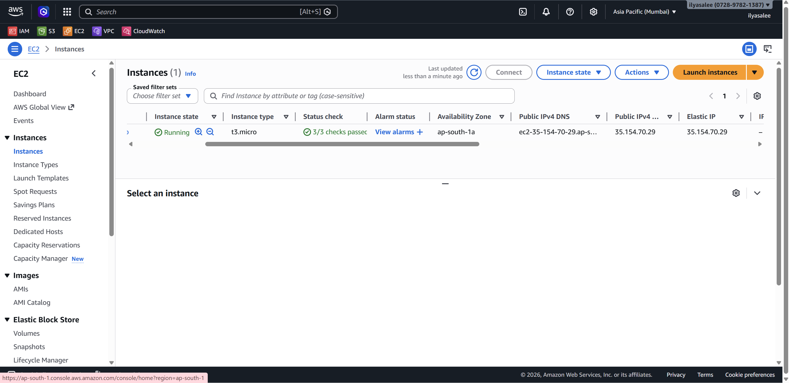
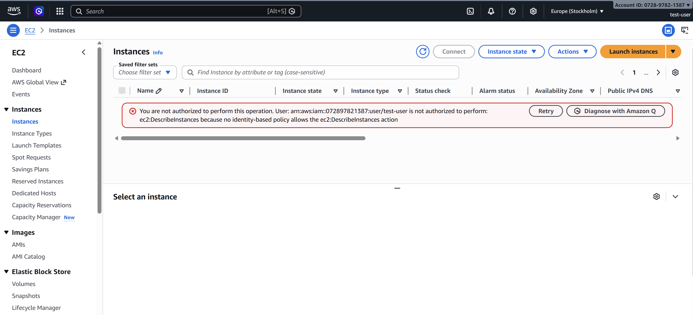
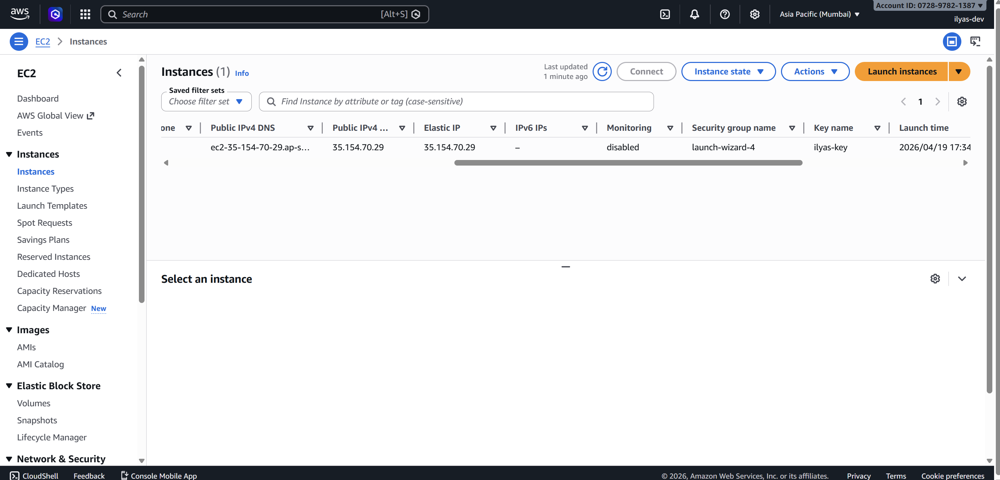

# AWS EC2 Static Website Hosting

## 🌐 Deployed Link
http://35.154.70.29

## 📸 EC2 Instance Screenshot

## 📸 User 1 - No Permissions

## 📸 User 2 - EC2 Access

## 🛠️ Steps Followed
1. Launched EC2 t2.micro (Ubuntu 24.04) from AWS Console
2. Installed Apache2 web server via SSH
3. Deployed static HTML/CSS website
4. Allocated Elastic IP and associated it with the instance
5. Created IAM User 1 with no permissions
6. Created IAM User 2 with AmazonEC2ReadOnlyAccess policy

## 🚧 Challenges Faced
- Had to open port 80 in Security Group for HTTP traffic
- IAM login URL is separate from root account login
- PEM key needed correct file permissions before SSH would work
